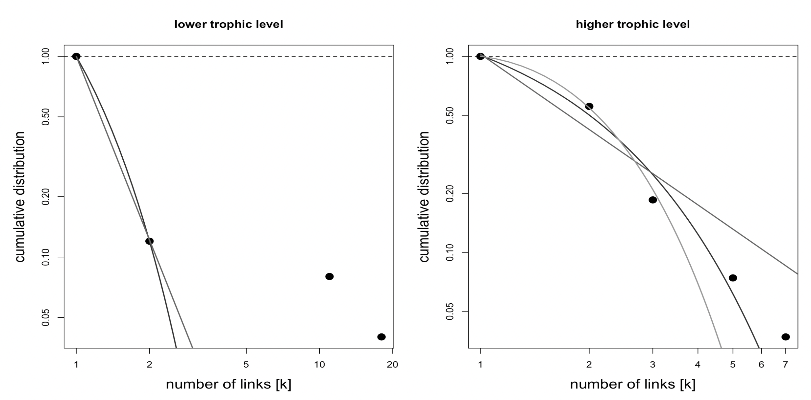
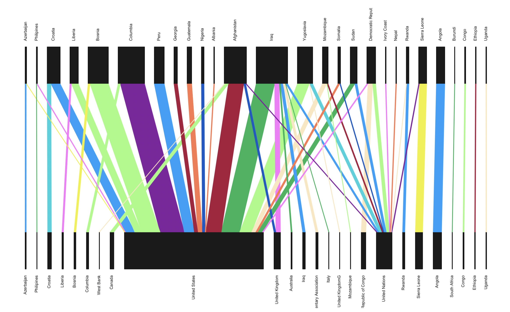

<h1 align="center">Network Analysis of Private Contracting in Failed States</h1>

#### Harrison Hartnett 
#### April 17th, 2025

## Background
  As a politics major in my final year of undergrad, I wanted to write my thesis about private military contracting. The trend of states employing private contractors to outsource military functions both during and since the Cold War has been well documented (Ori Swed and Daniel Burland 2020; Serres 2023). According to Swed and Burland: “The post-Cold War era opened the door for private entrepreneurs to market their security expertise more widely”. In 2003, the number of newly created PMSCs was 79, doubling in the two years since 2001, when only some 38 new PMSCs (Ori Swed and Daniel Burland 2020 p.3). These authors clearly show that the number of PMSCs has increased dramatically since the 1980s, until it plataus around 1200 in 2016. Private military contracting can be problematic for a number of reasons including the difficulty of classifying their employees under international humanitarian law (IHL) (Crowe and John 2017), the potential erosion of state monopolies on the legitimate use of force (Krahmann 2013), and as evidenced by the Abu Ghraib example, the increased potential for human rights violations.

  During my research, I realized that something was missing from the existing literature: a  clear accounting of which states tended to engage in private contracting, and where they chose to employ PMSCs. At the same time, I came across a dataset that could be extremely useful for this purpose; the Private Security Database (PSD). This is a database that tracks the deployment of private contractors in collapsing or failed states from 1990 to 2007. It was created as part of a research project "Privatization and Commercialization of Security", which is part of the Collaborative Research Center “Governance in Areas of Limited Statehood” in Berlin (https://www.conflict-data.org/psd/index.html). Although this is not a comprehensive list of all the private military contracting that occured in those years, this analysis is an important step in understanding the scope of PMSC use by states.

The following project is a network analysis of data from the private security database (PSD), focusing on two main questions:
- What insights can be gained about the general structure of the network of private contracting?
- Which countries or institutions tend to employ PMSCs the most?

Using igraph and bipartite R packages to visualize and analyze the network of private military contracting among states.

## Ethical Considerations
  This analysis uses publically available software and data for maximum reproducablility. All scholarly sources are referenced and all online resources have appropriate links. None of the data used contains any information that could be traceable to specific individuals. The etihcal considerations of private military contracting itself are duscussed in the background section.

## Visualizations & Analysis

This figure was generated using the igraph package. Nodes in this network represent countries. The size of the nodes corresponds to the degree, meaning that the most interconnected nodes will appear the largest (Note that the log of the vertex degree is actually used, because the difference between the largest and smallest nodes would be too great to visualize effectively otherwise). Edges represent instances of private contracting, with their direction showing which state was the employer of the PMSCs and which state the PMSCs were sent to. The thickness of the edges corresponds to the number of PMSCs engaged in that specific instance of contracting. Self referrential loops show when a state deployed PMSCs within its own borders.

  A cursory observation shows that large, powerful states and institutions such as the United States and the United Nations have deployed PMSCs to countries all over the world from 1990 to 2007. Countries which were affected by major international conflicts during that time such as Iraq and Afghanistan have a high degree not because they deployed PMSCs, but because many different states deployed PMSCs to those countries.

  This figure was generated using the bipartite package's degreedistr function. The lower level represents countries where PMSCs are operating/being sent, and the higher level represents the countries which are employing PMSCs. The degree distribution of the higher level follows the truncated-power law, which means that a relatively small proportion of the total countries are engaging in most of the private military contracting. This fits with what we would expect to see intuitively, that major states like the U.S are sending private military contractors all over the world, whereas smaller countries are engeging in much more limited contracting, perhaps only within their own borders such as Ethiopia or the Congo.

  This figure was generated using the biparite package's plotweb function. The width of the boxes corresponds to the degree of the nodes, just like the private security network visualization. The width of the lines connecting countries also means the same thing, however this visualization makes it more apparent that the United States tends to employ more PMSCs to a given country at the same time, whereas the United Nations tends to contract only one or a few PMSCs to a given country.

## Data Cleaning & Methods
  The dataset as it was originally downloaded contained many columns that this analysis wasn't particularly interested in, so the first important step was to group the data by the main factors I wanted to look at; Which countries were sending PMSCs (clientsc), and where they were being sent to (locsc). The code can be seen below.
  
prepped_data <- PSD %>%
  group_by(clientsc, locsc) %>%#I want to know which countries are sending PMSCs where
  summarize(
    contract_no = sum(nofirm)#Summarize the number of PMSCs deployed to a specific country
  )
  
Additionally, the names of the countries were abbreviated in the original dataset i.e Columbia = COL, so I created a for loop to str_replace_all each of the country abbreviations with the full names. 

  I then converted the dataframe into a matrix and then into an igraph graph object. Once I had a directed graph object, I assigned the degree and edge attributes. The degree attribute was simply the degree of the node in question, and the edge weight became the number of PMSCs engaged in a given instance of contracting. I set a seed for reproducability and proceeded to generate a layout using layout_nicely, which automatically tries to create the best layout for the network structure.

The initial visualization was quite messy because the difference between the highest and lowest degree, and the highest and lowest edgeweight was so high. I ended up using the log of both values, and using trial and error to multiply those log values to create a meaningful visualization.

  The bipartite analysis required me to build another edgelist grouping by clientsc. Then, using the frame2web and plotweb functions from the bipartite package I was able to generate another visualization to gain further insights. Using the object generated by the frame2webs I could generate network and node level summaries.

## Discussion
  This analysis reveals a lot about the trends of private military contracting between 1990 and 2007. The most obvious conclusion is that the United States, as the major world superpower, deployed more PMSCs to foreign territories than any other country or international organization. The node level summary revealed that the U.S sent PMSCs to 18 different countries during that time The United Nations, as the main international peacekeeping body that isn't a state, also deployed PMSCs to 11 different countries. Iraq and Afghanistan have degrees of 7 and 5 respectively, meaning that during the window of time the dataset covers, foreign PMSCs were sent into Iraq and 5 were sent into Afghanistan.

  Another interesting insight is that there was a lot more contracting within specific states (meaing a country such as Angola hiring PMSCs to operate within its own borders) than I initially expected. This may be related to the discussion of my thesis the general trend across the world towards outsourcing military functions to private industry. In Africa in particular, it is well documented that many governments became dependent on Cold War era military support from the great powers (the U.S.S.R and the U.S), and that as that support waned after the fall of the Soviet Union, private contractors stepped in to fill the gap left behind  (Lock 1998 p.21; y Vines 2005, 2013; Mills and Stremlau 1999).

## References
(All analysis in this project should be reproducable using only files from this github repo)

Crowe, Jonathan, and Anna John. 2017. “The Status of Private Military Security Companies in United Nations Peacekeeping Operations under the International Law of Armed Conflict.” Melbourne Journal of International Law 18(1): 16–44. doi:10.3316/informit.980092731941255.

Krahmann, Elke. 2013. “The United States, PMSCs and the State Monopoly on Violence: Leading the Way towards Norm Change.” Security Dialogue 44(1): 53–71. doi:10.1177/0967010612470292.

Ori Swed and Daniel Burland. 2020. “The Global Expansion of PMSCs: Trends, Opportunities, and Risks.” Working Group on the use of mercenaries as a means of violating human rights and impeding the exercise of the right of peoples to self-determination.

Serres, Dominic. 2023. “Re-Emergence of Private Military and Security Companies (PMSCs) in the Post-Cold War Era: Analyzing the Impact of Security Commodification Amidst Growing Global Power Rivalry.” https://ruj.uj.edu.pl/xmlui/handle/item/314598 (March 29, 2025).

Vines, Alex. 2013. “A Decade of African Peace and Security Architecture.” International
Affairs 89(1): 89–109. doi:10.1111/1468-2346.12006.

Mills, Greg, and John Stremlau. 1999. “The Privatisation of Security in Africa.”
https://policycommons.net/artifacts/1452656/the-privatisation-of-security-in-africa/20844
70/ (March 23, 2025).

Lock, Peter. 1998. “Military Downsizing and Growth in the Security Industry in Sub‐Saharan
Africa.” Strategic Analysis. doi:10.1080/09700169808458891.

Luke, D. (2015). A User’s Guide to Network Analysis in R. Germany: Springer International Publishing.
